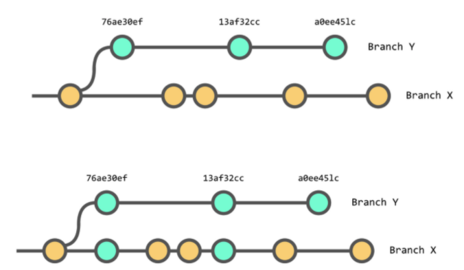

# Cherry Pick

## 언제 사용?

* 다른 브랜치에 잘못 커밋할 때
* 요구 사항이 바뀌어 필요 없는 커밋이 생길 때
* 코드 의존성 때문에 다른 사람의 커밋 중 일부를 가져와야하는 경우

## 명령어

```
git cherry-pick <commit>
```

## 그림 Example



## Reference

1. [https://imasoftwareengineer.tistory.com/7](https://imasoftwareengineer.tistory.com/7)
